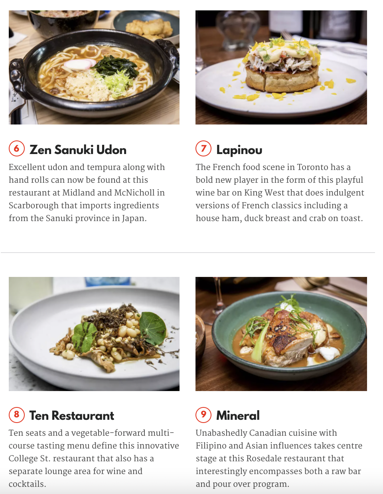

# Foody (WIP)

## I hate searching for new restaurants

I often find myself searching on Google for something like:

"Best restaurants in Toronto"
"Good restaurants for a date"
"Best brunch in Montreal"
"Happy hour in Miami"

I end up clicking on a blog like blogTO or TimeOut that offers me a list of 10-100 restaurants with 1 picture and a brief description.

Then every time I see a potential candidate for a for a new restaurant I have to:

1. Copy and paste the restaurant name (or remember it)
1. Open a new tab
1. Search for `[name of restauarant]` Yelp on Google
1. Click on the Yelp search result
1. Check the rating and pictures
1. Click "Get Directions" to see how far it is
1. Type in my address because use my location never seems to work on Yelp
1. Finally decide if I want to go to the restaurant tonight.

Then by the end of this I decide I want to dine there I have to:

1. Open a new tab
1. Search for `[name of restaurant]` OpenTable on Google
1. Click on the OpenTable search result
1. Enter my reservation details
1. Find out that there are no reservations available for the time I want to go
1. Start all over again.

This takes forever, and I end up giving up on actually looking at ratings, menus or pictures and pick the first one that looks half decent and has an available table.

I just want to save some time for myself, and I hope that this can save some time for you too.

## Introducing Foody

I don't know exactly what features I will build for Foody yet but I want to make a Chrome Extension that allows you to click on the name of a restaurant and quickly popup a modal that shows you a menu, pictures, distance and ratings from Yelp alongside an OpenTable widget.
