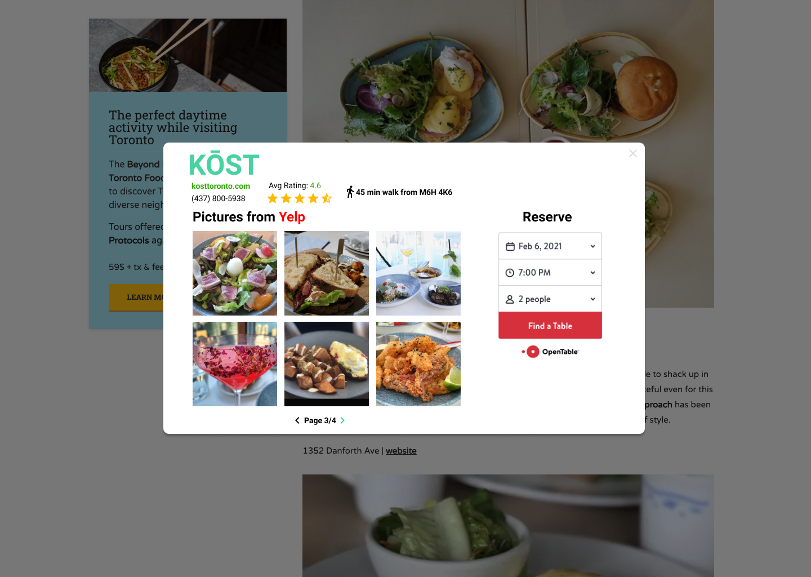

## Foody

Foody is a Chrome Extension that takes the friction out of researching new restaurants. 

When you learn of a new restaurant you are potentially interested in from a blog post after Googling something like "Top restaurants in Toronto", you may decide to open up multiple more tabs to learn more about the restaurant. Maybe you go to Yelp to check out its rating and reviews, go to Instagram to get a better idea of the atmosphere, go on Google Maps to check how far away it is from you, then finally go on OpenTable to make a reservation. It takes many clicks and many websites to get all the information you might want on a restaurant. 

Foody aims to make the process a lot faster by giving you everything you need without having to navigate away from the page you discovered the restaurant on. Simply highlight the name of the restaurant you want to learn more about, and click "Show on Foody". 

The Foody window shows ratings, reviews, photos and other information from multiple sources such as Instagram, Yelp and Google. It also provides an OpenTable widget that shows reservation availability and allows you to make a reservation right then and there.

You no longer have to scour through multiple sources to decide if you want to go to the restaurant or not, only to find out that there are no tables avaialble anyways once you finally make up your mind and get to OpenTable.

